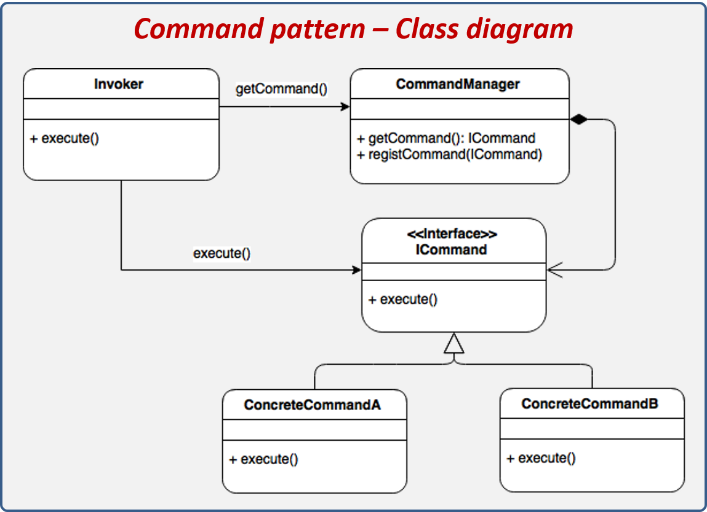

## Command pattern
* __Catégorie__:
    * Comportement
* __OBJECTIFS__
    * Encapsuler une requête sous la forme d'objet.  
    * Paramétrer facilement des requêtes diverses.  
    * permettre des opérations réversibles.
* __Résultat__
    * Le design pattern permet d'isoler une requête.

* __Graphe__  

