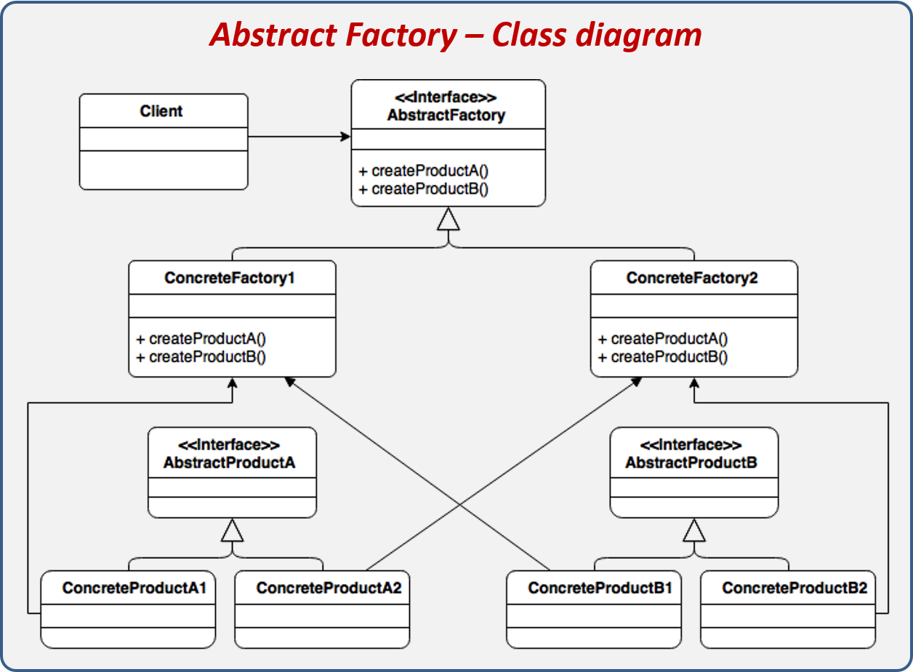

## Fabrique abstraite (Abstract Factory)
* __Catégorie__:
    * Création
* __OBJECTIFS__
    * Fournier une interface pour créer des objets d'une même famille sans préciser leurs classes concrètes.
* __RESULTAT__:
    * Le Design Pattern permet d'isoler l'appartenance à une famille de classe.
* __Graphe__  

