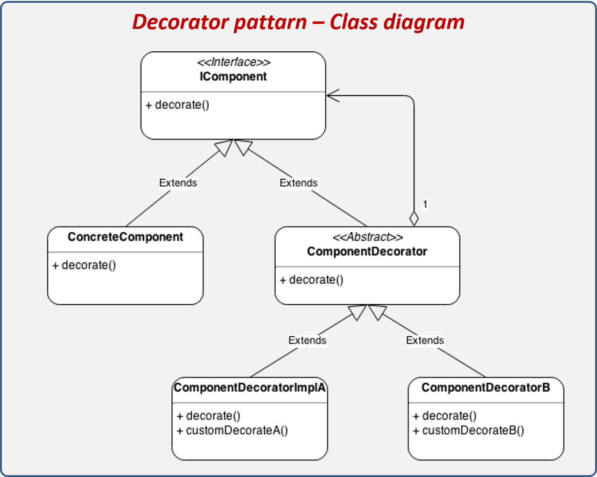

## Decorator
* __Catégorie__:
    * Création
* __OBJECTIFS__
    * Le pattern Décorateur attache dynamiquement des responsabilités supplémentaires au un objet. il fournit une alternative souple à la dérivation,pour étendre les fonctionnalités
* __RESULTAT__:
    * le Design pattern permet d'isoler les responsabilités d'un objet.
* __Graphe__  

